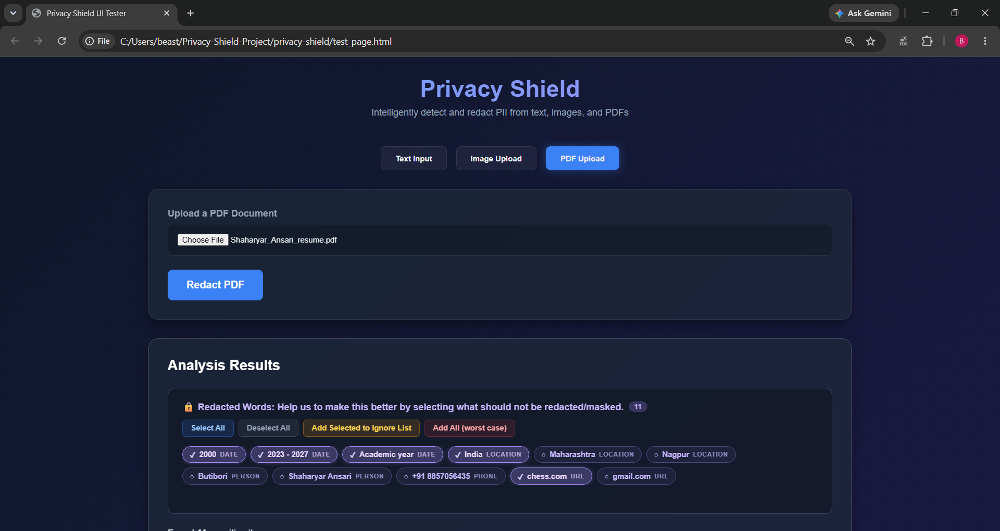
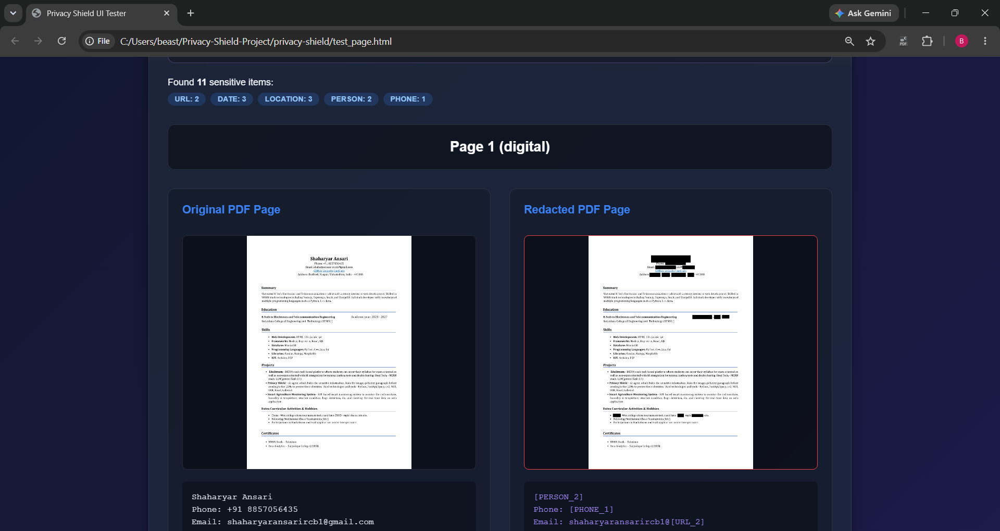
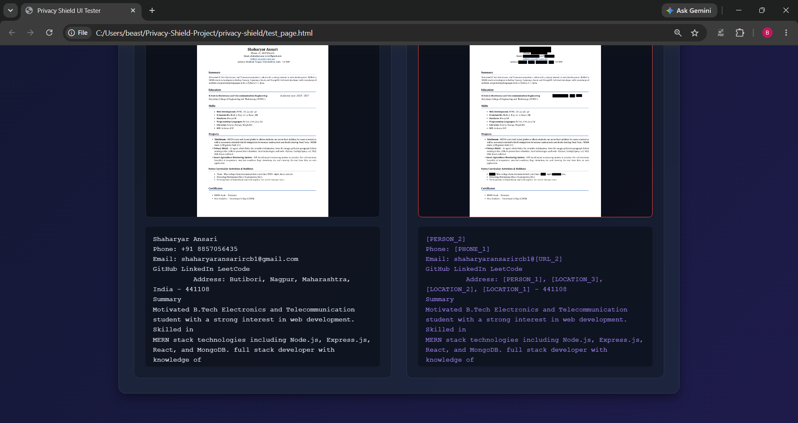

# Privacy Shield

> AI-powered PII (Personally Identifiable Information) detection and redaction engine. Protect sensitive data before sharing documents with LLMs, reviewers, or any third-party service.


---

## What It Does

Privacy Shield automatically detects and masks sensitive personal information in **text**, **images**, and **PDF documents** before you share them with AI tools, reviewers, or any third party.

| Input Type | What It Does |
|---|---|
| **Text** | Replaces PII with safe placeholders like `[PERSON_1]`, `[EMAIL_1]` |
| **Image** | OCR extracts text → detects PII → draws black boxes over sensitive regions |
| **PDF** | Processes each page (digital text extraction or OCR for scans) → redacts PII |

### Supported PII Types (15+)

| Category | Types Detected |
|---|---|
| **Identity** | Person Names, Organization Names |
| **Contact** | Email Addresses, Phone Numbers (Indian/US/International) |
| **Documents** | Aadhaar Number, PAN Card, SSN, Passport Number |
| **Financial** | Credit/Debit Card Numbers (with Luhn validation) |
| **Location** | Addresses, Cities, Countries, PIN/ZIP Codes |
| **Digital** | URLs, IP Addresses |
| **Temporal** | Dates, Date of Birth |

---

## Tech Stack

| Layer | Technology |
|---|---|
| **Frontend** | React 19 + Vite |
| **Backend** | Python FastAPI |
| **NLP** | spaCy (`en_core_web_lg`) |
| **OCR** | EasyOCR |
| **Image Processing** | OpenCV |
| **PDF Processing** | PyMuPDF |

---

## Project Structure

```
privacy-shield/
├── python-engine/           # FastAPI backend
│   ├── main.py              # API endpoints (scrub-text, redact-image, redact-pdf)
│   ├── text_scrubber.py     # Core PII detection engine (regex + NLP)
│   ├── image_redactor.py    # OCR + visual redaction
│   ├── pdf_handler.py       # PDF text extraction + page-level processing
│   └── requirements.txt     # Python dependencies
├── src/                     # React frontend
│   ├── App.jsx              # Main app with tab navigation
│   ├── components/
│   │   ├── TextInputPanel.jsx
│   │   ├── ImageInputPanel.jsx
│   │   ├── PdfInputPanel.jsx
│   │   └── ResultsPanel.jsx # Side-by-side results + download buttons
│   ├── utils/
│   │   └── api.js           # API client functions
│   └── index.css            # Dark glassmorphism theme
├── index.html
├── package.json
└── vite.config.js
```

---

## Setup & Installation

### Prerequisites

- **Python** 3.11+
- **Node.js** 18+
- **npm** 9+

### 1. Clone the Repository

```bash
git clone https://github.com/<Mr-Tuigor>/privacy-shield.git
cd privacy-shield
```

### 2. Python Backend

```bash
cd python-engine

# Create virtual environment
python -m venv venv

# Activate it
venv\Scripts\activate          # Windows
# source venv/bin/activate     # macOS/Linux

# Install dependencies
pip install -r requirements.txt

# Download the spaCy NLP model
python -m spacy download en_core_web_lg

# Start the API server
uvicorn main:app --reload --host 127.0.0.1 --port 8000
```

The API will be available at `http://localhost:8000` with Swagger docs at `http://localhost:8000/docs`.

### 3. React Frontend

```bash
# From the project root (privacy-shield/)
npm install
npm run dev
```

Open `http://localhost:5173` in your browser.

---

## API Endpoints

| Method | Endpoint | Description |
|---|---|---|
| `GET` | `/api/health` | Health check + model status |
| `POST` | `/api/scrub-text` | Scrub PII from plain text |
| `POST` | `/api/restore-text` | Restore scrubbed text using PII map |
| `POST` | `/api/redact-image` | Redact PII from an uploaded image |
| `POST` | `/api/redact-pdf` | Redact PII from an uploaded PDF |

### Example: Scrub Text

```bash
curl -X POST http://localhost:8000/api/scrub-text \
  -H "Content-Type: application/json" \
  -d '{"text": "Contact Amit Sharma at amit@gmail.com or +91-98765-43210"}'
```

**Response:**
```json
{
  "original": "Contact Amit Sharma at amit@gmail.com or +91-98765-43210",
  "sanitized": "Contact [PERSON_1] at [EMAIL_1] or [PHONE_1]",
  "pii_map": {
    "[PERSON_1]": "Amit Sharma",
    "[EMAIL_1]": "amit@gmail.com",
    "[PHONE_1]": "+91-98765-43210"
  },
  "entities": {
    "total_entities": 3,
    "by_type": { "PERSON": 1, "EMAIL": 1, "PHONE": 1 }
  }
}
```

---

## How It Works

Privacy Shield uses a **two-phase detection pipeline**:

1. **Phase 1 — Regex** (high precision): Catches structured PII like emails, phone numbers, Aadhaar, PAN, dates, credit cards, etc. These are replaced first to prevent the NLP model from misinterpreting them.

2. **Phase 2 — NLP** (names & locations): Uses spaCy's Named Entity Recognition to find unstructured PII like person names, organization names, and addresses. An allowlist filters out false positives (tech skills, resume headers, etc.).

---

## Screenshots



### Text Redaction
Upload or paste text containing personal information → see the original alongside the sanitized version with all PII replaced by safe placeholders.

### Image Redaction
Upload an image (screenshot, photo of a document) → the tool OCRs the text, detects PII, and draws black boxes over sensitive regions.

### PDF Redaction
Upload a PDF document → each page is processed individually. Digital PDFs use direct text extraction; scanned PDFs are OCR'd page by page.

---

## License

MIT License — see [LICENSE](LICENSE) for details.
